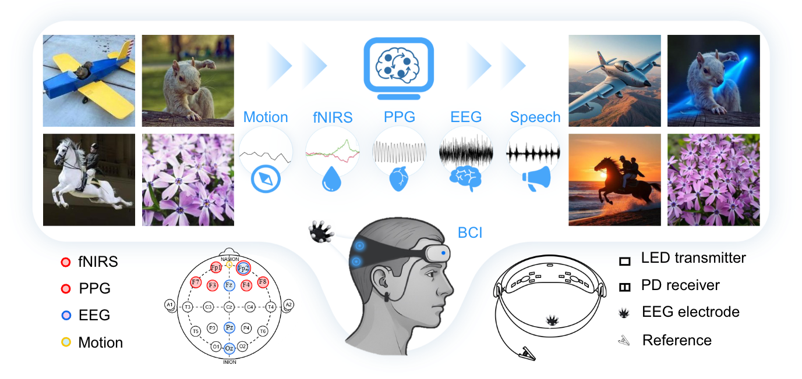

# LoongX

> **LoongX: Neural-Driven Image Editing**

[**🌐 Homepage**](https://LoongX1.github.io/) ｜ [**📖 Paper**](https://arxiv.org/search/?query=loongx&searchtype=all) ｜ [**🚀 Quickstart**](https://github.com/LanceZPF/loongx#-quick-start) | [**🖊️ Citation**](https://github.com/LanceZPF/loongx#-citation)

This repository is the official implementation of the paper [Neural-Driven Image Editing](https://github.com/LanceZPF/loongx).

## 💡 News

- `2025/07/08`: The homepage has been launched and will be continuously updated. Stay tuned!
- `2025/07/07`: The homepage, demo and data are coming soon one by one. Stay tuned!
- `2025/07/06`: The paper is being uploaded to arXiv...

## 📖 Introduction

We introduce LoongX, which effectively integrates multimodal neural signals to guide image editing through novel Cross-Scale State Space (CS3) encoder and Dynamic Gated Fusion (DGF) modules. Experimental results demonstrate that editing performance using only multimodal neural signals is comparable to text-driven baselines (CLIP-I: 0.6605 vs. 0.6558), and the combination of neural signals with speech instructions surpasses text prompts alone (CLIP-T: 0.2588 vs. 0.2549), proving the method's effectiveness and its significant potential in intuitive and inclusive human-AI interaction.



## 🚀 Quick Start
### Setup (Optional)
1. **Environment setup**
```bash
conda create -n loongx python=3.10
conda activate loongx
```
2. **Requirements installation**
```bash
pip install -r requirements.txt
```

<!-- ### Guidelines for subject-driven generation
1. Input images are automatically center-cropped and resized to 512x512 resolution.
2. When writing prompts, refer to the subject using phrases like `this item`, `the object`, or `it`. e.g.
   1. *A close up view of this item. It is placed on a wooden table.*
   2. *A young lady is wearing this shirt.*
3. The model primarily works with objects rather than human subjects currently, due to the absence of human data in training. -->

### Training
Training instructions can be found in this [guide](./train/README.md).

### Inference
For inference, please refer to `inference.sh`. You need to modify the input and output paths in the script.

### Evaluation
For evaluation, please refer to `test.sh`. You need to modify the input and output paths in the script.


## 🖊️ Citation

> **Coming soon. Please check back after the paper is available on arXiv.**
